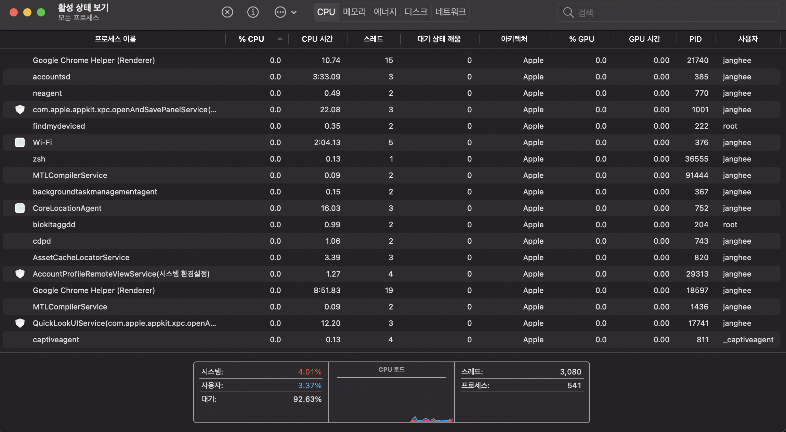
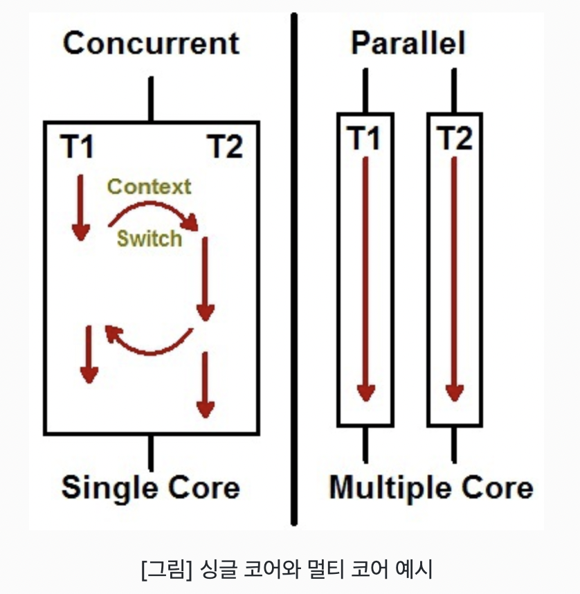

# 운영체제

하드웨어에게 일을 시키는 주체가 바로 운영체제입니다. 또 한 하드웨어의 설계를 바탕으로 하드웨어에게 일을 시킵니다.

---

## 운영체제

### 시스템 자원관리

운영체제는 하드웨어에게 일을 시킬 수 있도록 도오줍니다. 하드웨어를 구성하는 일은 프로세스 관리(CPU), 메모리 관리, I/O(입출력)관리(디스크,네트워크 등)을 합니다. 이러한 시스템 자원을 관리하는 주체가 바로 운영체제 입니다.

<!--  -->

 

### 응용 프로그램 관리

시스템의 자원을 마음대로 사용한다면 헤커에 의한 공격에 무방비한 상태가 됩니다. 그래서 응용 프로그램은 권한에 대한 관리가 필요합니다. 그래서 응용 프로그램이 실행되고, 시스템 자원을 사용할 수 있도록 권한과 사용자를 관리합니다.

 

## 응용 프로그램 : 운영체제를 통해 컴퓨터에게 일을 시키는 것 (System call)

응용 프로그램이 운영체제를 통해 컴퓨터에게 일을 시키려면 권한을 운영체제로 부터 받아야 합니다. 응용 프로그램이 운영체제와 소통하기 위해서는, 운영체제가 으용 프로그램을 위해 인터페이스(API)를 제공해야 합니다. 이러한 시스템 자원을 사용할 수 있도록 다양한 함수를 제공하는 것을 시스템 콜(System call)이라고 합니다.  

예를들어 응용 프로그램이 프린터 사용에 대한 권한을 획득한 후에는, 프린터를 사용할 때 필요한 API를 호출해야 합니다. 이 API는 시스템 콜로 이뤄져 있습니다.

[참고자료](https://parksb.github.io/article/5.html)

 

---

# 프로세스, 스레드, 멀티 스레드

## 프로세스(Process)

사용자가 애플리케이션을 실행하면, 운영체제로 부터 실행에 필요한 메모리를 할당 받아 애플리케이션의 코드를 실행합니다. 이때 실행되는 애플리케이션을 프로세스라고 부릅니다.

 

## 스레드(Thread)

하나의 스레드는 코드가 실행되는 하나의 흐름이기 때문에, 한 프로세스 내에 스레드가 두 개라면 코드가 실행 되는 흐름이 두 개 생긴다라는 의미입니다. 

 

### 스레드 특징

1. 프로세스 내에서 실행되는 흐름의 단위
2. 각 스레드 마다 call stack이 존재(call stack : 실행중인 서브루틴을 저장하는 자료 구조)
3. 스레드는 다른 스레드와 독립적으로 동작

### 프로세스와 스레드 구성

<!--  -->786 × 658

 

## 멀티 스레드(Multi-Thread)

멀티 태스킹은 두 가지 이상의 작업을 동시에 처리하는 것을 의미합니다. 운영체제는 멀티 태스킹을 할 수 있도록, 프로세스마다 CPU 및 메모리 자원을 적절히 할당하고 병렬로 실행합니다. 멀티 스레드는 다양한 곳에서 사용됩니다. 대용량 데이터의 처리시간을 줄이기 위해 데이터를 분할 하여 병렬로 처리하는 데에 사용할 수도 있고, UI를 가지고 있는 애플리케이션에서 네트워크 통신을 하기 위해 사용 할 수도 있습니다.  

여러 클라이언트의 요청을 처리하는 서버를 개발할 때에도 사용됩니다.

<!--  -->

 

### 멀티 스레딩의 장점

1. 동시에 처리하던 일을 스레드로 구현할 경우, 메모리 공간과 시스템 자원의 소모가 줄어듭니다.
2. 프로세스 간 통신 방법(IPC)에 비해 스레드 간의 통신 방법이 훨씬 간단하다.
3. 시스템의 처리량이 향상되고 자원 소모가 줄어들어 자연스럽게 프로그램의 응답 시간이 단축 됩니다.

 

### 멀티 스레딩의 문제점

1. 멀티 프로세스 기반으로 프로그래밍을 할 때에는 프로세스 간 공유하는 자원이 없습니다.
2. 서로 다른 스레드가 같은 데이터에 접근하고, 힙 영역을 공유하기 때문에 서로 다른 스레드가 서로 사용중인 변수나 자료구조에 접근하여 엉뚱한 값을 읽어오거나 수정하는 일이 방생할 수 있습니다.

 

## 동시성과 병령성의 차이

<!--  -->

동시에 돌릴 수 있는 스레드 수는 컴퓨터에 있는 코어 갯수로 제한됩니다. 운영체제(또는 가상 머신)는 각 스레드를 시간에 따라 분할하여, 여러 스레드가 일정 시간마다 돌아가면서 실행되도록 합니다. 이런 방식을 시분할이라고 합니다.  

- Concurrency(동시성, 병행성): 여러 개의 스레드가 시분할 방식으로 동시에 수행되는 것처럼 착각을 불러일으킴
- Parallelism(병렬성): 멀티 코어 환경에서 여러 개의 스레드가 실제로 동시에 수행됨

 

## Context Switching이란?

다른 태스크(프로세스, 스레드)가 시작할 수 있도록 이미 실행중인 태스크(프로세스, 스레드)를 멈추는 것을 Context Switching이라 합니다.

