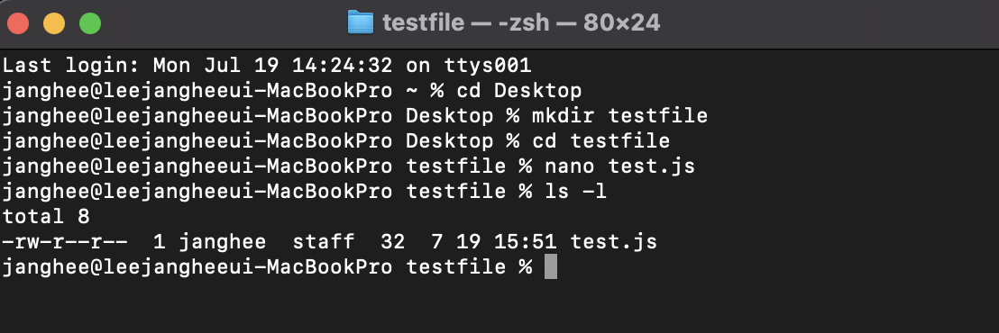

# Linux_사용권한과_환경변수 #1

---

## 사용권한에 대해 알아 볼 것

1. 폴더와 파일의 권한으로 폴더인지 구별하는 방법
2. 폴더나 파일의 사용권한 변경 방법

---

## 폴더인지 파일인지 구별하는 방법

터미널창에 `mkdir`과 `nano`를 활용해서 아래와 같이 진행하고 `ls -l`를 입력하면 폴더인지 파일인지 구별할수 있습니다. `-`시작은 not directory로 파일을 의미합니다. `d`시작은 directory로 폴더를 의미합니다.

```js
// testfile 폴더를 생성하고 test.js파일을 생성
mkdir testfile
nano test.js
```

실행되면 입력창에 console.log('아무거나') 작성하고 `ctr1 + x,y,Enter` 순서대로 입력하면, 새로운 파일을 저장할수 있습니다. 저장 후 터미널 창에 `ls -l` 입력하면 아래와 같이 출력됩니다. 

<br />



<br />

`-rw-r--r--` 출력에서 `-`로 시작 되었기 때문에 test.js는 파일임을 확인 할 수 있습니다. 그렇다면 rwe 이런 기호는 무엇을 의미할까요 ?
<br />


<br />

정리하자면 아래와 같습니다.  

1. r은 read permission 읽기 권한을 뜻합니다.
2. w는 write permission 쓰기 권한을 뜻합니다.
3. x는 execute permission 실행 권한을 뜻합니다.

그렇다면 아까 출력한 `-rw-r--r--`를 해석하면 **소유자는 읽기 쓰기가 가능하고 나머지 그룹은 읽기만 가능하다**라는 뜻입니다.

### 용어정리 User, Group, Other

Access class         |의미
:------------------:|:------------------:
  user  | 파일의 소유자입니다.(파일을 만든 사람)
  group | 여러 유저가 포함 그룹에 속한 모든 유저는 파일에 대한 동일한 그룹 엑세스 권한을 갖습니다.
  other | 파일을 만들지 않은 다른 모든 유저를 의미합니다.


## chmod : 권한을 변경하는 명령어

명령어 `chmod`는 파일이나 폴더의 읽기,쓰기,실행 권한을 변경할수 있습니다.(폴더나 파일의 소유자가 같을 경우만, 같지 않을 경우 `sudo`를 이용) `chmod`를 통해 권한을 변경하는 방식은 두가지가 있습니다.


### Symbolic method

Symbolic method방법은 +,-,0으로 엑세서 유형을 표기해서 변경합니다.

Access class         |Operator|Access Type
:------------------:|:------------------:|:----------------:
u(user) |+(add access)   |r(read)
g(group)|-(remove access)|w(write)
o(other)|=(set exact access)|x(execute)
a(all:u,g, and o)||

### Symbolic method 사용 예시

```js
chmod a=rw test.js //# -rw-rw-rw-
chmod u= test.js //# ----rw-rw-
chmod a+rx test.js //# -r-xrwxrwx
chmod go-wx test.js //# -r-xr--r--
chmod a= test.js //# ----------
chmod u+rwx test.js //# -rwx------
```

### Absolute form

Absolute form방법은 숫자7까지 나타내는 3bits의 합으로 표기하는 방법입니다.
<br />

Permission | Number
:-------:|:-------:
Read(r)  |  4
Write(w) |  2
Execute(x) | 1

<br />

Absolute form에서 사용하는 숫자 표입니다. 외우는것보단 참고용으로 쓰는게 좋습니다.
<br />

Num| Sum | rws | Permission
:----:|:----:|:----:|:----:
7	| 4(r) + 2(w) + 1(x) |	rwx	| read, write and execute
6	| 4(r) + 2(w) + 0(-) |	rw-	| read and write
5	| 4(r) + 0(-) + 1(x) |	r-x	| read and execute
4	| 4(r) + 0(-) + 0(-) |	r--	| read only
3	| 0(-) + 2(w) + 1(x) |	-wx	| write and execute
2	| 0(-) + 2(w) + 0(-) |	-w-	| write only
1	| 0(-) + 0(-) + 1(x) |	--x	| execute only
0	| 0(-) + 0(-) + 0(-) |	---	| none

### Absolute form 사용 예시

```js
//# u=rwx (4 + 2 + 1 = 7), go=r (4 + 0 + 0 = 4)
chmod 744 test.js //# -rwxr--r--
```

---

## 최종 정리

### 사용권한

폴더와 파일인지 구분하기 위해서 터미널에 `ls -l` 입력하여 `-`로 시작하면 파일, `d`로 시작하면 폴더입니다.<br />
폴더나 파일의 사용권한을 변경하기 위해선 `chmod`키워드 뒤에 **Symbolic method** 방법 이나 **Absolute form** 방법으로 표기하면 됩니다. Symbolic method방법은 +,-,= 으로 표기하고 Absolute form는 rwx를 3bit으로 해석하여 숫자 3자리로 권한을 표기합니다.